# Final Game Video

https://youtu.be/2ut5E2CASdw

# Link To Game On itch.io

https://natebentleyoutlookcom.itch.io/crystalis

# Summary

This game was created to align with the topic title 'Procedural Dungeon Generation For Rogue-like Games' for my dissertation.
It is a project that looks into these three areas of game design:

## Procedural Level Generation

This creates a randomised 3D level based on the level that you are on, which has different heights and stiarways/ bridges to get the different rooms on the floating sky pirate level.

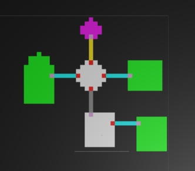

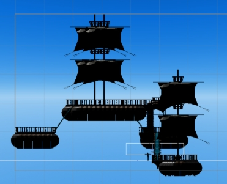

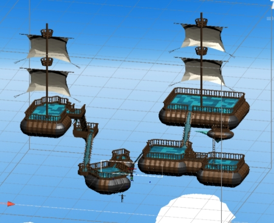

Other than the floor tiles, the objects and enemies are also placed within specific rooms situations using the marching squares algorithm, and are positioned based on the height of that specific room. The base algorithm is by Barbara Eckhart's lecture series, and I developed it further for the 3D Environment.

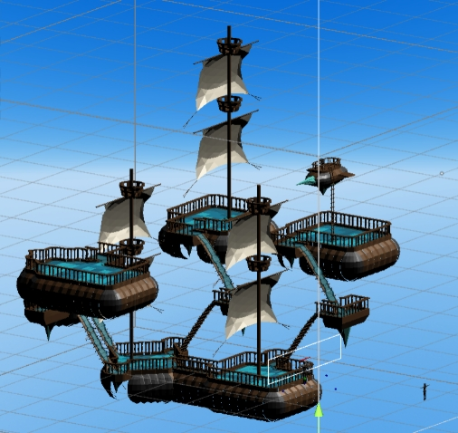
## User Interface, Character Abilities and Progression

 

For this project, it was important for different users to be able to enjoy the game and see visible progression

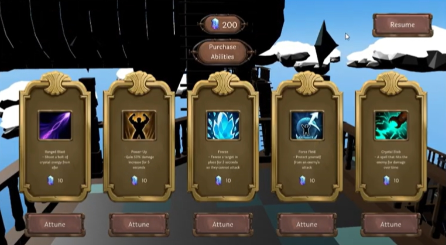

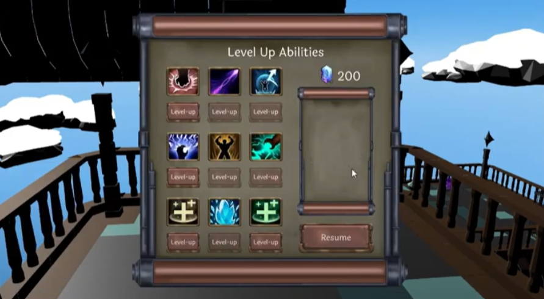

For the UI of the game, I wanted to incorporate the tracking of the levels and objectives per level as well. At the beginning of each level the 

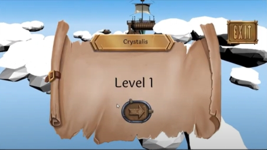
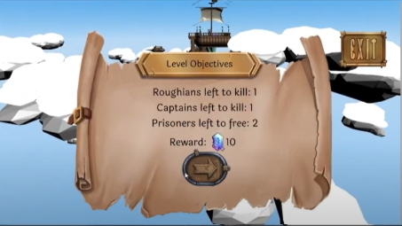

## Enemy Difficulty Scaling and Pathfinding

The enemy movement and pathfinding was an important part of the game as it made the enemies feel more realistic. THe way this was created was through 
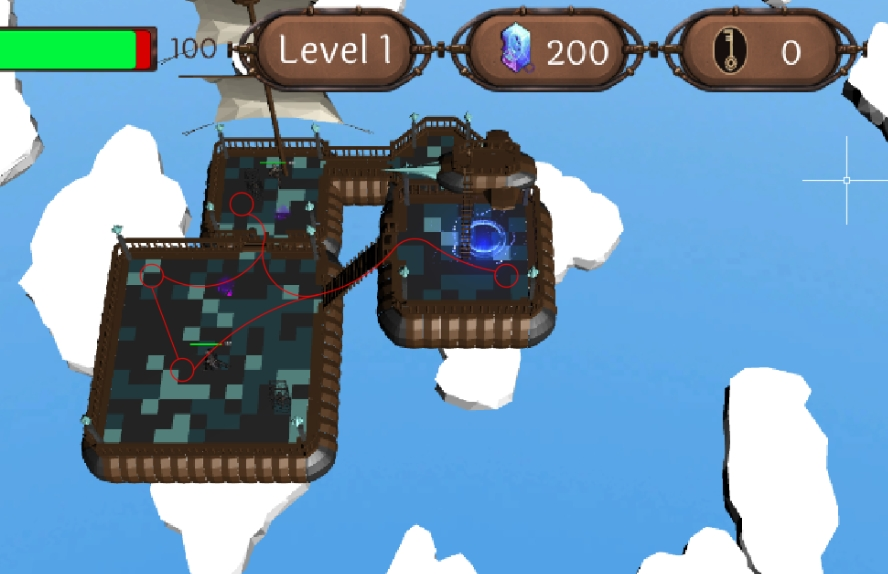
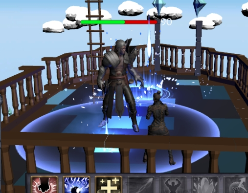
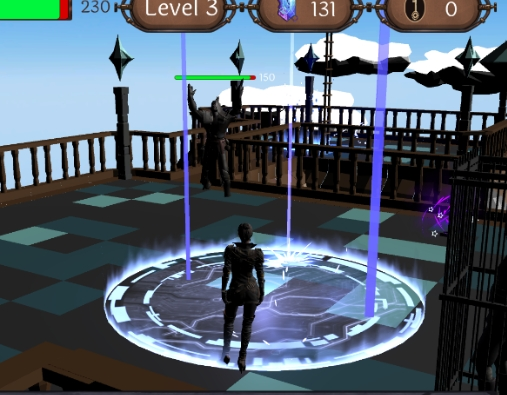
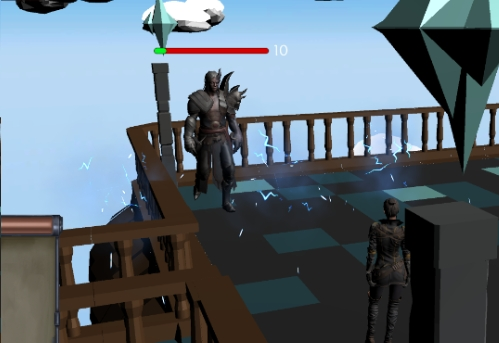
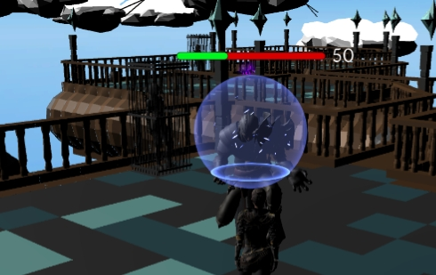
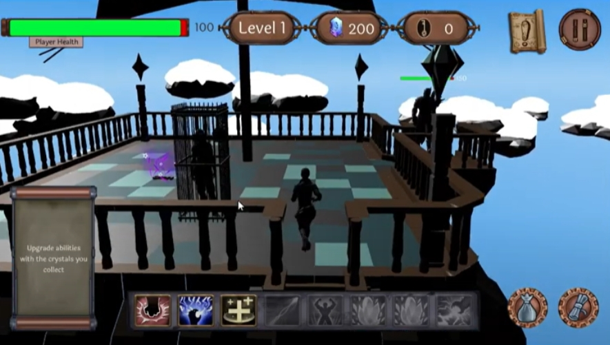
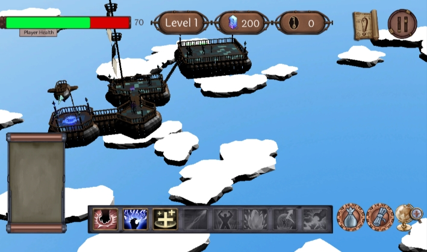

