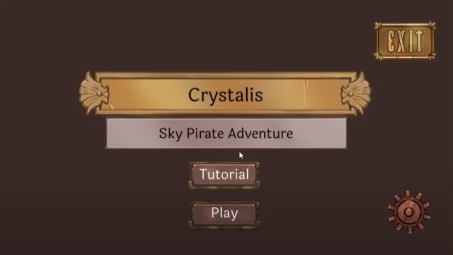

# Final Game Video

https://youtu.be/2ut5E2CASdw

# Link To Game On itch.io

https://natebentleyoutlookcom.itch.io/crystalis

# Summary

This game was created to align with the topic title 'Procedural Dungeon Generation For Rogue-like Games' for my dissertation.
It is a project that looks into these three areas of game design:

## Procedural Level Generation

This creates a randomised 3D level based on the level that you are on, which has different heights and stiarways/ bridges to get the different rooms on the floating sky pirate level.

## Enemy Difficulty Scaling and Pathfinding

The enemies

## Character Abilities and Progression

Throughout the project I worked on player / user testing to 
